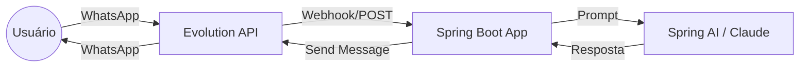

# 🗳️ Heitorzinho — Bot Raio-X Político com IA para WhatsApp 🗳️

[](https://www.oracle.com/java/)
[](https://spring.io/projects/spring-boot)
[](https://www.docker.com/)
[](https://spring.io/projects/spring-ai)

O **Raio-X Político** é uma solução robusta de backend desenvolvida para automatizar a interação com eleitores via WhatsApp. Utilizando o poder do **Spring AI** com o modelo **Claude Sonnet**, o bot fornece informações precisas e contextualizadas sobre candidatos e o cenário eleitoral brasileiro.

---

## Diferenciais Técnicos

Este projeto foi construído seguindo as melhores práticas de desenvolvimento de software, focando em escalabilidade e manutenção:

* **Arquitetura Orientada a Eventos:** Uso de Webhooks para comunicação em tempo real com a Evolution API.
* **Processamento Assíncrono:** Implementação de `@Async` para garantir que o bot não bloqueie a thread principal durante o processamento da IA.
* **Segurança e Padronização:** Utilização de **DTOs** (Data Transfer Objects) para tráfego de dados e **Services** para isolamento da regra de negócio.
* **Ambiente Conteinerizado:** Setup completo via **Docker**, facilitando o deploy e a consistência entre ambientes.

---

## Arquitetura do Sistema

O fluxo de dados foi desenhado para ser resiliente e rápido:


---

## Tecnologias Utilizadas
```
    ├── Core: Java 17 & Spring Boot 3.x
    ├── Inteligência Artificial: Spring AI (Integração com Claude 3.5 Sonnet)
    ├── Integração WhatsApp: Evolution API (v2)
    ├── Banco de Dados: PostgreSQL (Persistência de logs e contextos)
    ├── DevOps: Docker & Docker Compose
    └── Ferramentas: Maven, Lombok, Jackson
```
---

## Funcionalidades
```
    [x] Resposta em Tempo Real:** Interação fluída via WhatsApp.

    [x] Integração com LLM:** Respostas inteligentes baseadas em dados políticos.

    [x] Gestão de Webhooks:** Endpoint pronto para receber e validar eventos da Evolution API.

    [x] Arquitetura Escalável:** Código modularizado por camadas (Controllers, Services, Repositories).
```
---

## Como Rodar o Projeto

### Pré-requisitos
**Docker e docker-compose instalados.**

**Uma chave de API da Anthropic (Claude) ou modelo configurado no Spring AI. (modelo pago, mas pode trocar também)**

**Instância da Evolution API rodando.**

Instalação
    Clone o repositório:

Bash
```
**git clone [https://github.com/leandrobanin/bot-of-the-brazilian-elections.git](https://github.com/leandrobanin/bot-of-the-brazilian-elections.git)**
**cd bot-of-the-brazilian-elections**
```
**Configure as variáveis de ambiente:**
**Crie um arquivo .env ou edite o application.yml com suas credenciais:**

YAML
```
spring:
  ai:
    anthropic:
      api-key: ${ANTHROPIC_API_KEY}
evolution:
  api:
    url: ${EVOLUTION_URL}
    key: ${EVOLUTION_KEY}
```
**Suba os containers:**
```
Bash
docker-compose up -d
```
**O servidor estará rodando em: ```http://localhost:8080```**

## Estrutura de Pastas (Principais)
```
Plaintext
src/main/java/com/projeto
    ├── config/         # Configurações de Bean, Async e AI
    ├── controller/     # Endpoints de Webhook
    ├── dto/            # Objetos de transferência de dados (Request/Response)
    ├── service/        # Lógica de integração com AI e Evolution API
    └── repository/     # Interface de persistência
```

## Autor

Leandro Augusto Banin
Jr. Engineer Software | Information Technology Student
